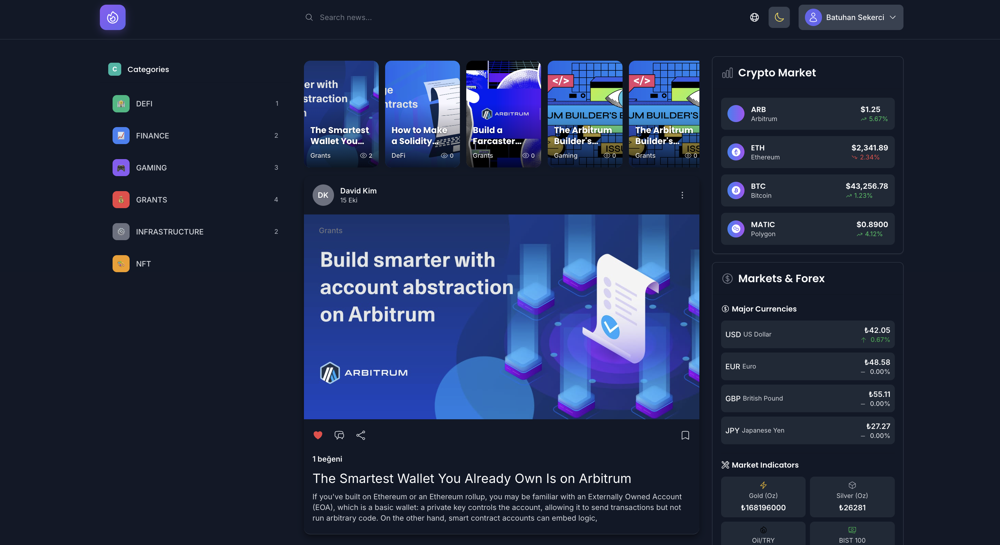
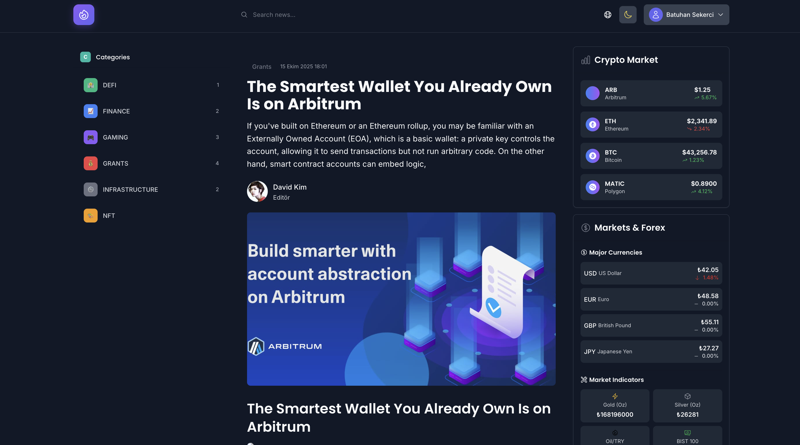
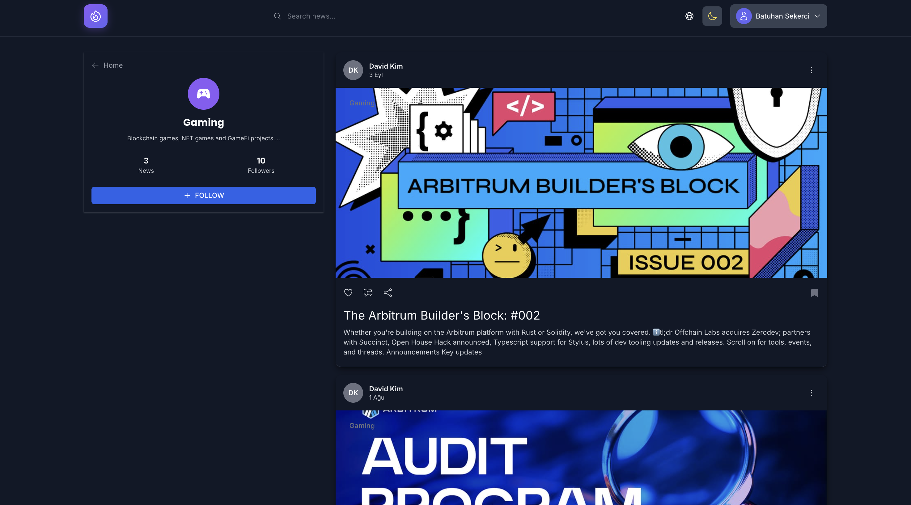
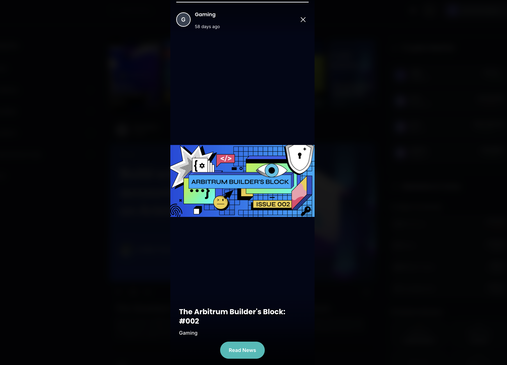
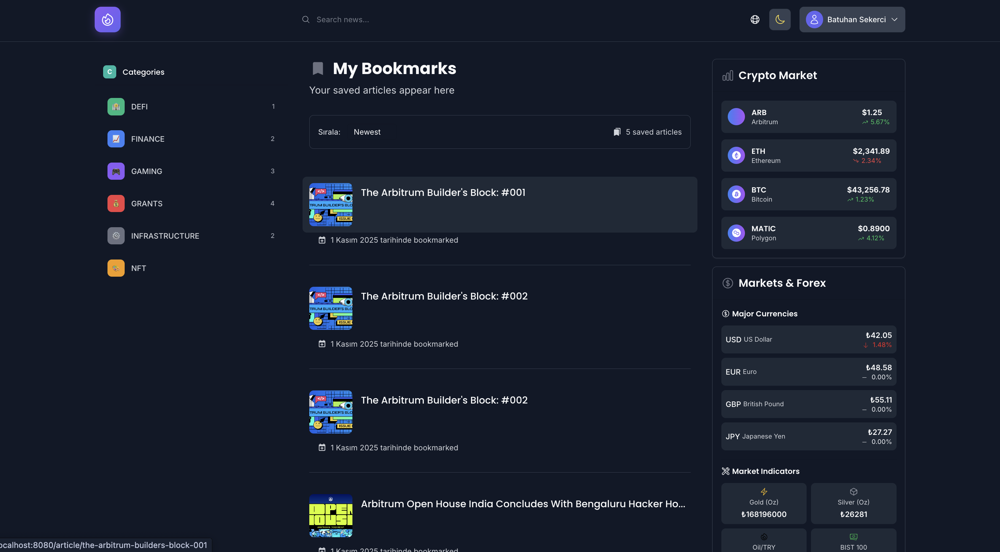
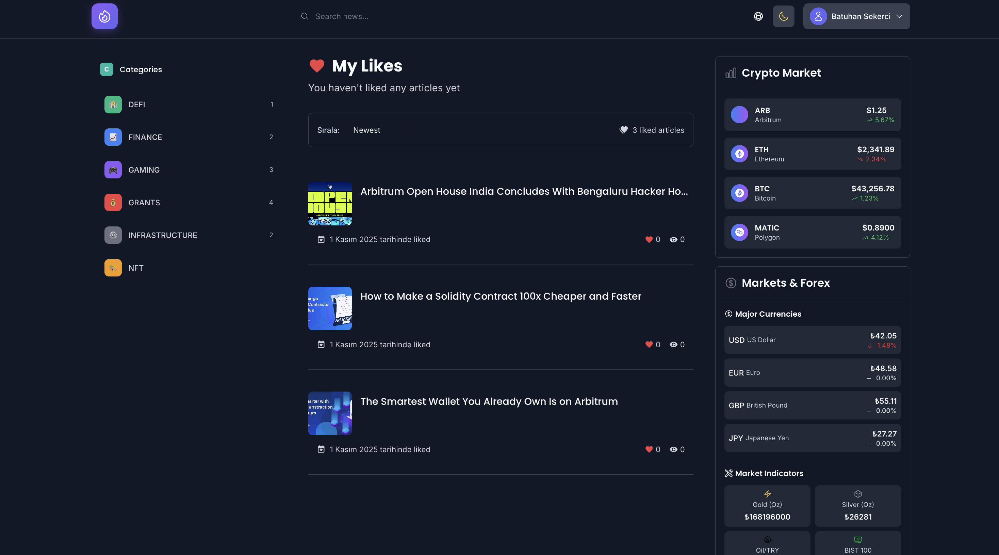
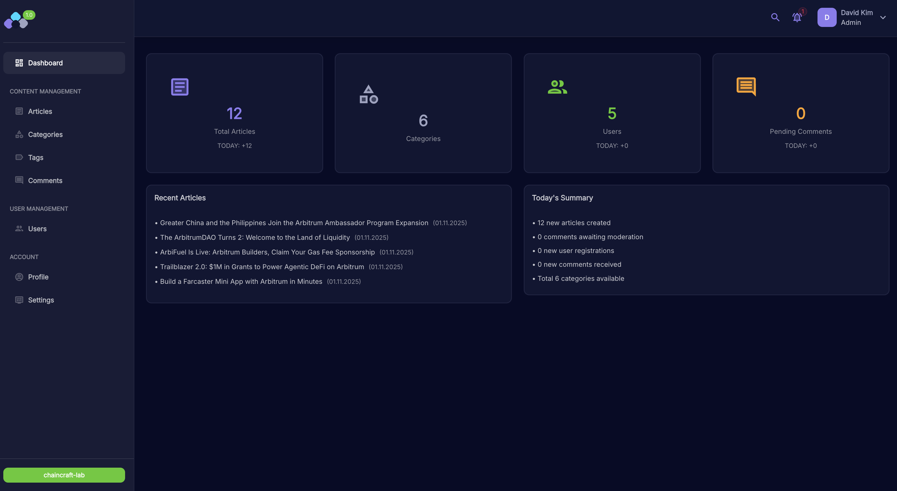
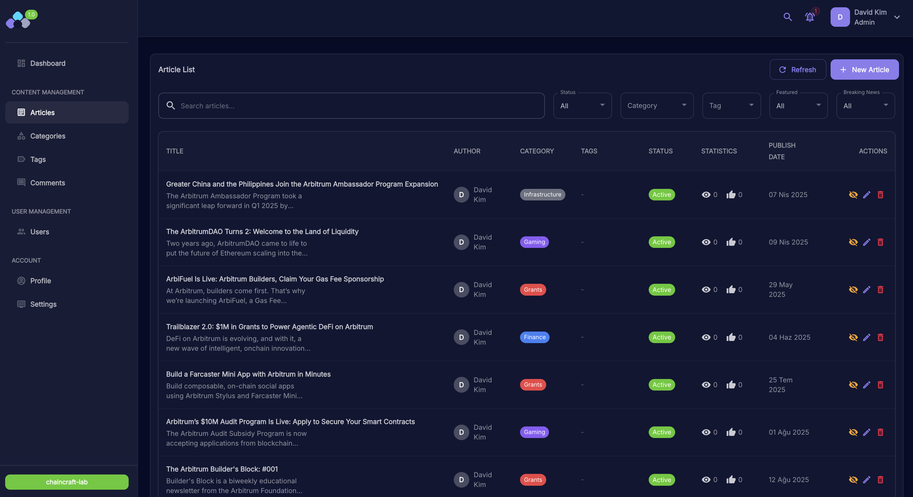
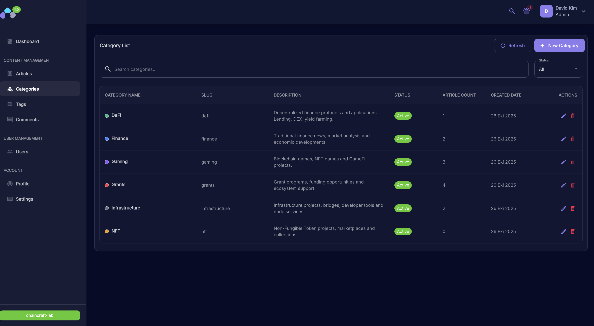
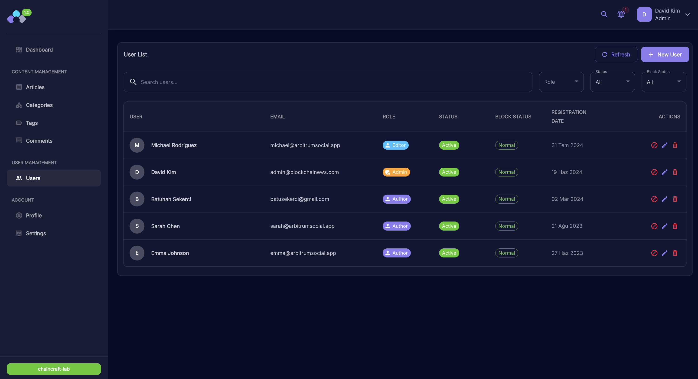

# ArbitrumSocial

Modern, responsive blockchain social media platform built with Vue.js and Tailwind CSS.

## Features

- Modern component-based architecture using Vue 3
- Responsive design that works on all devices
- Custom UI components (buttons, cards, badges, inputs)
- Social posts display with categories and featured content
- Layout components (navbar, footer, sidebar)
- Mock API services for development
- Vuex store for state management
- Vue Router for navigation

## Project Structure

- `/src/components/ui`: Reusable UI components
- `/src/components/social`: Social media specific components
- `/src/components/layout`: Layout components
- `/src/views`: Page components
- `/src/layouts`: Layout templates
- `/src/api`: API services and mock data
- `/src/assets`: Static assets and CSS

## Design System

- **Color Palette**: #459c98 (teal), #f28f80 (coral), #ffffff (white), #2e3d3c (dark green), #d9e3e2 (light gray-green)
- **Typography**: Inter, Poppins, Merriweather
- **Custom Tailwind configuration** with extended theme

## Getting Started

### Prerequisites

- Node.js (v14 or later)
- Yarn or npm

### Installation

```bash
# Clone the repository
git clone <repository-url>

# Navigate to project directory
cd chain-social-app

# Install dependencies
yarn install
# or
npm install
```

### Development

```bash
# Start development server
yarn serve
# or
npm run serve
```

### Building for Production

```bash
# Build for production
yarn build
# or
npm run build
```

### Linting

```bash
# Lint and fix files
yarn lint
# or
npm run lint
```

## Screenshots

### Web Application

#### Home Page

*Main landing page with featured articles and navigation*

#### Article Detail

*Individual article view with content and metadata*

#### Category Page

*Category-based article filtering and browsing*

#### Story Feature

*Story format content display*

#### Bookmarks

*User bookmarked articles collection*

#### Likes

*User liked articles overview*

### Admin Dashboard

#### Admin Home

*Admin dashboard overview and statistics*

#### Article Management

*Content management and article administration*

#### Category Management

*Category creation and management interface*

#### User Management

*User administration and management panel*

## Future Enhancements

- Enhanced admin panel features
- User authentication and subscription features
- Banner ad management system
- Analytics integration
- Enhanced SEO features
- Comments and social sharing functionality

## License

This project is licensed under the MIT License.
